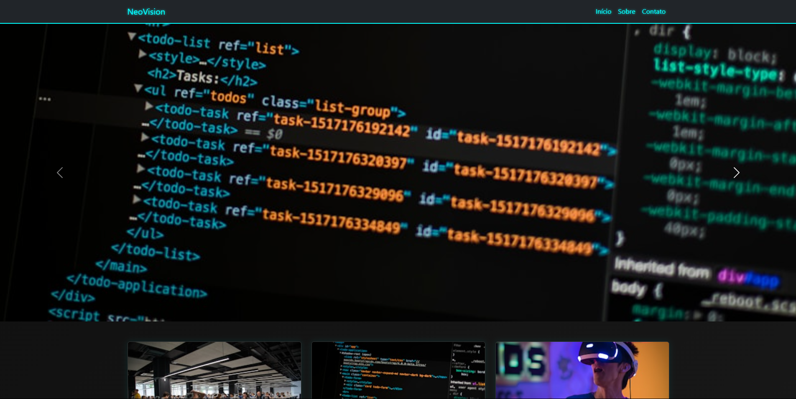

# Futuristic Simple Bootstrap Site

[🇺🇸 English Version](README.md) | [🇧🇷 Versão em Português](PT-BR-README.md)

---

## Project Overview

  

---

This is a responsive and futuristic-themed website built with **Bootstrap 5**.  
It features a **carousel**, a **responsive grid layout** with cards, and **modals** for detailed info.  
The design uses a dark cyberpunk-inspired style and works well across desktop, tablet, and mobile devices.

---

## Technologies Used
- **HTML5**  
- **CSS3** (external stylesheet with dark futuristic theme)  
- **Bootstrap 5** (grid, carousel, cards, modals)  
- **JavaScript** (Bootstrap bundle for carousel and modals)  

---

## Features
✅ Responsive carousel with futuristic images  
✅ Responsive grid layout: 3 cards per row on desktop, 2 on tablet, 1 on mobile  
✅ Cards with images, titles, and descriptions  
✅ "Learn more" buttons open themed modals with extra info  
✅ Dark mode cyberpunk style with smooth hover effects  

---

## Project Structure
```
📂 futuristic-bootstrap-site
├── 📄 index.html
├── 📄 styles.css
├── 📄 README.md
├── 📄 PT-BR-README.md
```
---

## How to Use
1. Clone or download the repository.  
2. Open `index.html` in your browser.  
3. Navigate through the carousel and cards.  
4. Click "Learn more" on any card to open detailed modals.  

---

## Future Improvements
- Add a contact form with validation  
- Implement a light/dark mode toggle  
- Add animations and transitions for more interactivity  
- Connect to backend API for dynamic content loading  

---

### Author

💻 Developed by **Gabriel Camarate**  
⭐ If you liked this project, please give it a star on GitHub!  

---

### License
This project is open source and available under the MIT License.
